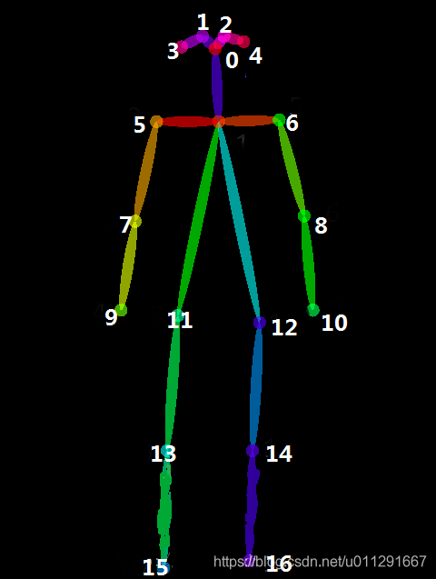
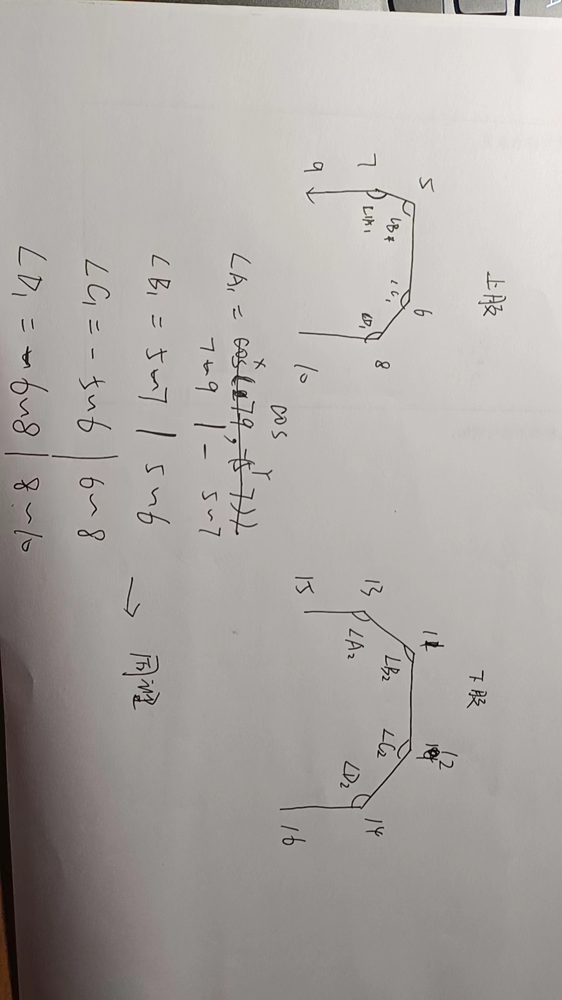

# SCORE
在这部分我们对关心部分关键点和其对应连接的向量，并用这部分向量之间的相似度约束动作的得分标准计算每个动作的得分。
## 数据集
本次数据集采用COCO2017人体目标检测数据集，其格式规范为：
```commandline
json_
{
1-‘nose’, 
2-‘left_eye’ 
3-‘right_eye’,
4-‘left_ear’,
5-‘right_ear’,
6-‘left_shoulder’,
7-‘right_shoulder’,
8-‘left_elbow’,
9-‘right_elbow’,
10-‘left_wrist’, 
11-‘right_wrist’,
12-‘left_hip’,
13-‘right_hip’,
14-‘left_knee’,
15-‘right_knee’,
16-‘left_ankle’，
17-‘right_ankle’
}

```

从图中结构看来我们并不需要关心01234他是固定的，对于行为动作标准我们仅考虑一下键值对之间的角度关系我们把他分为不同的动作域

### 对于向量的标准方向做一约定：
* **up->down** 
* **left->right**
* **定义 5 6 中点 x (pos_5 + pos_6) / 2**

### 上肢体信息


    5-7 : "左大臂" 
    7-9 : “左小臂”
    5-6 : "肩部"
    6-8 : "右大臂" 
    8-10: "右小臂"

###  下肢体信息

    11-13 : "左大腿"
    13-15 : ”左小腿“
    11-12 : ”胯“
    12-14 : ”右大腿“
    14-16 : ”右小腿“

我们完成这些定义之后需要定义角度的方向，具体说是向量的正方向
### 角度定义

    A1 B1 C1 D1
    A2 B2 C2 D2

我们更希望是如下的形式:

那么这种数据结构根据公式推导来定义就很简单了,我们只需要按照顺序存储上肢体信息或者下肢体信息。

` \theta = COS(edge[i],edge[i+1]) `

那么我们实现这样一个函数即可，我们输入一张图片，和关键点的所有坐标，返回字典,字典包含按照顺序定义的肢体间的角度，并在图像上将其画出来，标注出对应角度值，以及最终的评分。

我们在CalcAngle.py 计算出了定义的各个角度值，然后再根据std_angle.py里的标准动作值，来计算得分？

我们用对比现有数据和计算数据的角度组的MSE，以此作为衡量的依据，


    std_angle.py 里面的数据你根据自己的需求去定义吧

```
D:\App\anaconda\envs\mcm\python.exe E:\A_CS\CS_6th\狗儿子的毕设还要我做\Hrnet\Score\CalcAngle.py 
upper
Edges {'1': [7, 9], '2': [5, 7], '3': [5, 6], '4': [6, 8], '5': [8, 10]}
Vector [[74.72511599999999, 27.137250000000023], [-20.379569999999973, -81.41178000000002], [101.897906, -6.784320000000008], [0.0, -115.33333000000002], [-20.379585999999996, -94.98041]]
Angle [0.9771587657666367, 1.7496013055841486, 1.6372777908492613, 0.21136149305542395]
lower
Edges {'1': [13, 15], '2': [11, 13], '3': [11, 12], '4': [12, 14], '5': [14, 16]}
Vector [[74.72511999999999, -101.76472999999999], [-20.37957, -142.47057], [74.72514, 0.0], [-6.803200000000004, -149.25490000000002], [-6.783190000000005, -142.47054999999995]]
Angle [2.3661398630571586, 1.7128765639098795, 1.5252467713555846, 0.0020256910074662017]
SCORE 91.42631023222955

Process finished with exit code 0

```
在后面补充了画线的函数 它定义了有边点集
然后对应画

实验数据对比发现 下肢角度信息更加有用